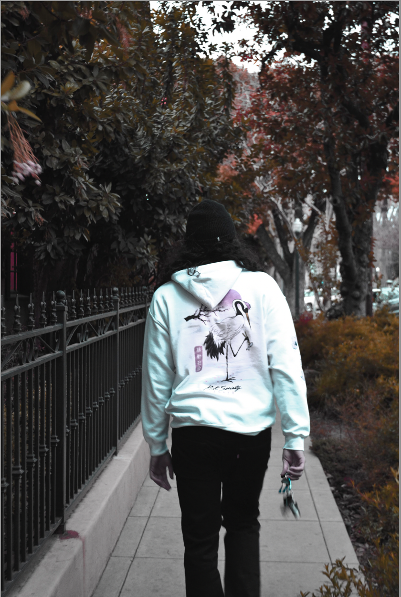
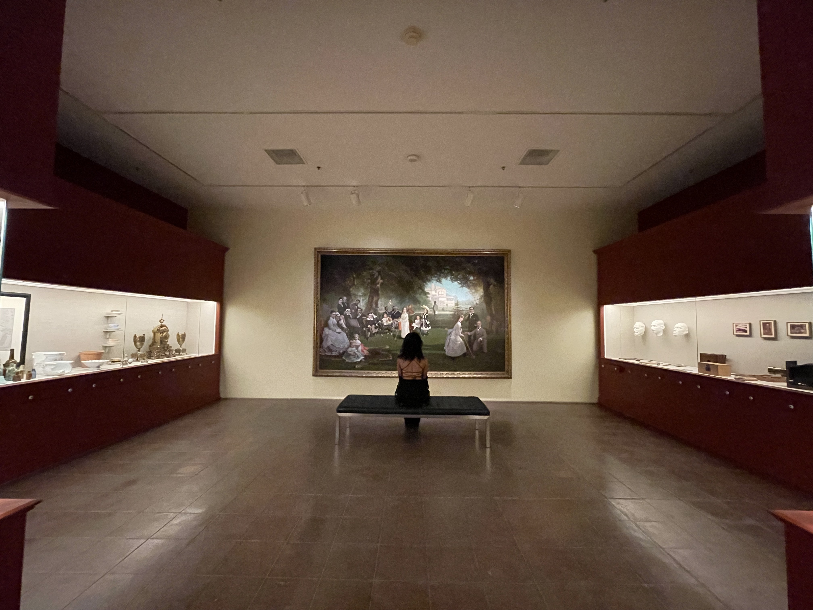

<!DOCTYPE html>
<html>
<head>
<title>W3.CSS Template</title>
<meta charset="UTF-8">
<meta name="viewport" content="width=device-width, initial-scale=1">
<link rel="stylesheet" href="tempo.css">
<link rel="stylesheet" href="https://fonts.googleapis.com/css?family=Audiowide">
<link rel="stylesheet" href="https://fonts.googleapis.com/css?family=Lexend">

</head>
<body>

<!-- !PAGE CONTENT! -->

  <!-- Header -->
  <header class="w3-container w3-xlarge w3-padding-24">
    <a href="landingpage.html" class="w3-left w3-button w3-white">Daily AL Chronicals</a>
    <a href=".html" class="w3-right w3-button w3-white">Photography</a>
    <a href="dma.html" class="w3-right w3-button w3-white">Digital Art</a>
    <a href="design.html" class="w3-right w3-button w3-white">Design</a>
    <a href="socialmedia.html" class="w3-right w3-button w3-white">Media</a>
    <a href="video.html" class="w3-right w3-button w3-white">Video</a>
    <a href="about.html" class="w3-right w3-button w3-white">About</a>
</header>

  <!-- PHOTO GRid -->
  

    

      
    

    

      
    

  

  

  

<!-- End Page Content -->

<!-- Footer / About Section -->

</body>
</html>
